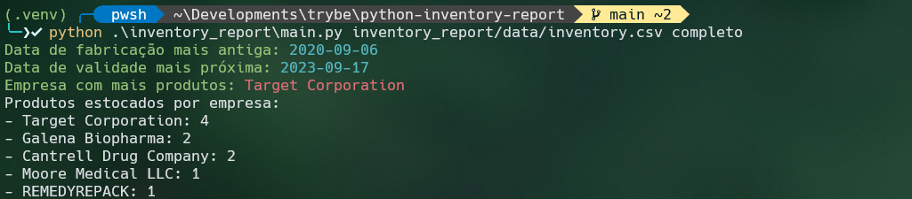

# Python Inventory Reports
Aplicação que realiza a leitura de arquivos com dados de estoque e gera, como saída, um relatório acerca destes dados. 

Os dados de estoques são obtidos via arquivos que podem ser do tipo `JSON`, `CSV` ou `XML`. Além disso, o relatório final possuirá duas versões: simples e completa.


Foi utilizando no desenvolvimento os conceitos de Orientação a Objetos em Python, testes e padrões de projetos.

## Funcionalidades
- Leitura e escrita de arquivos (XML, CSV, JSON)
- Formatação dos dados para gerar relatórios



## Tecnologias

- [Python](https://www.python.org/) - Linguagem de programação focada em desenvolvimento rápido e integração de sistemas eficazmente
- [Pytest](https://docs.pytest.org/en/7.2.x/) - Framework que facilita a escrita de testes pequenos e legíveis

## Project structure

```
$PROJECT_ROOT
|   # Código Python
├── inventory_report
│   |   # Arquivos com dados de estoque
|   ├── data
│   │   ├──  inventory.csv
│   │   ├──  inventory.json
│   │   └──  inventory.xml
│   |   # Classes responsáveis por ler arquivos
|   ├── importer
│   │   ├──  csv_importer.py
│   │   ├──  importer.py
│   │   ├──  json_importer.py
│   │   └──  xml_importer.py
│   |   # Classes que leem os arquivos e retornam relatórios
|   ├── inventory
│   │   ├──  inventory_iterator.py
│   │   ├──  inventory_refactor.py
│   │   └──  inventory.py
│   │   └──  product.py
|   |   # Classes que geram relatórios
│   ├── reports
│   │   ├──  colored_report.py
│   │   ├──  complete_report.py
│   │   └──  simple_report.py
│   └──  main.py
|   # Testes 
└── tests
```
